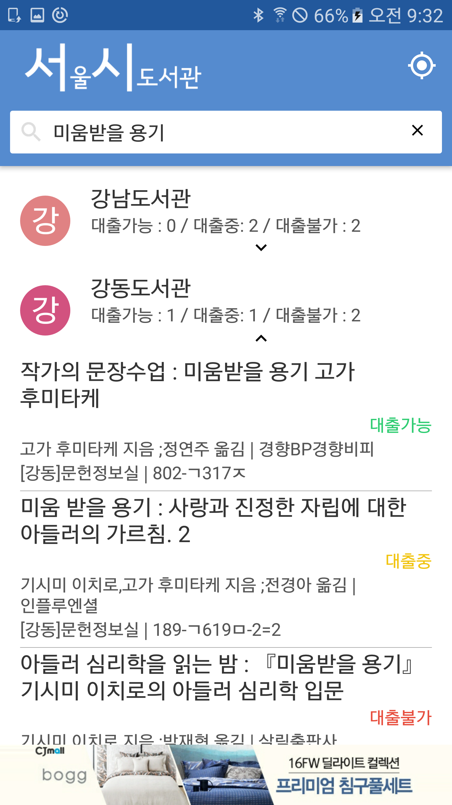
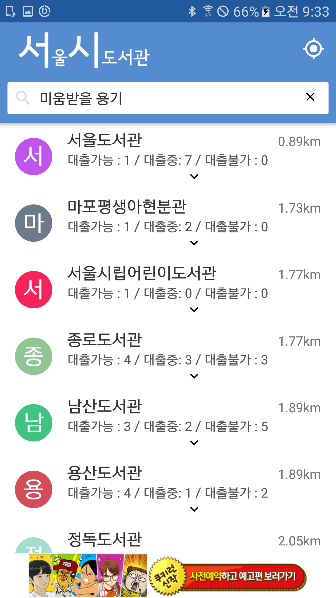

# 서시 - 서울시 공공도서관 통합 도서검색 앱
서울시에서 주최한 서울시 앱 공모전을 위해 구현한 프로젝트로 서울시 시립도서관을 한꺼번에 검색할 수 있는 통합 검색 앱입니다.
플레이스토어에 올라간 상태고 많은 다운로드 부탁드려요 :)
[링크](https://play.google.com/store/apps/details?id=com.seoul.publicbooksearcher)

## 주요기능
- 도서 통합 검색 (총 23군데 도서관 지원 - 서울도서관, 강남도서관, 강동도서관 등)
- 도서명 자동완성
- 최근 검색어 저장 및 가져오기
- 검색내용 캐시에 저장하기
- 동일한 도서검색시 캐시 사용하기
- 가까운 도서관 찾기

## 주요화면
| 검색 화면  | 가까운 도서관 찾기 화면 |
| ------------- | ------------- |
|   |   |

## 구현
- [Clean Architecture](https://github.com/android10/Android-CleanArchitecture) 를 참고하여 프로젝트의 틀을 잡고 Rxjava, Requery(Android ORM)로 비지니스 로직을 구현함
- Android Annotation 을 활용하여 클래스 간 의존성을 주입하는 코드를 없애고 코드 다이어트 함
- Firebase 와 연동하여 일일 사용자 방문 수를 확인하고 치명적 버그를 발견 및 수정하고 있음  

## 디렉토리 구조
- src 
    - data : 최근 검색어 저장, 검색 결과 캐싱 
    - domain
        - dto : 사용자에게 전달한 데이터를 담는 클래스
        - exception : 각종 예외 클래스 (책 검색 실패 예외)
        - models : 앱 도메인 클래스 (책, 도서관, 위치 등)
        - usecase : 각종 비지니스 로직 클래스 (도서 검색, 가까운 도서관 찾기 등)
    - infrastructure
        - crawler
            - book : 도서검색을 위한 웹 크롤러 
            - title : 검색어 자동완성을 위한 웹 크롤러 (반디앤루니스 사용)
    - presentation : Presenter 클래스로 화면 출력 
  